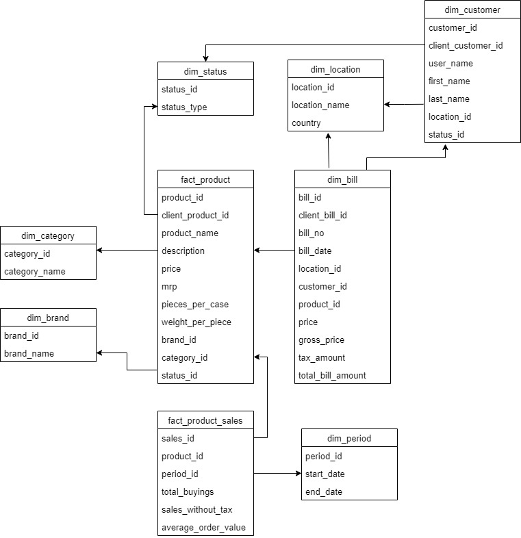

##Physical and Conceptual Modelling Sales Scenario

Now, according to the gathered requirements, the models are prepared. For the conceptual part,
fact and dimension tables are identified and their potential attributes are listed. The
relationship between the tables are also identified.

 

Potential Schema for the Scenario

---
**Identifying the Datatypes and domains of attributes**
---

|Attribute      |Domain      |Datatype
|---------------|------------|--------------
|  **dim_status**             |            |   
|status_id               | Unique identifier for dimemsion status table           |   AUTO INCREMENT, PRIMARY KEY
|status_type      |     Active or Inactive status       |VARCHAR, NOT NULL
|  **dim_location**             |            |   
|location_id               | Unique identifier for dimemsion location table           |   AUTO INCREMENT, PRIMARY KEY
|location_name      |    A certain unique location        |VARCHAR, NOT NULL
|country      |    Country of the location        |VARCHAR, NOT NULL
|  **dim_category**             |            |   
|category_id               | Unique identifier for dimemsion category table           |   AUTO INCREMENT, PRIMARY KEY
|category_name      |    A name of category        |VARCHAR, NOT NULL
|  **dim_brand**             |            |   
|brand_id               | Unique identifier for dimemsion brand table           |   AUTO INCREMENT, PRIMARY KEY
|brand_name      |    A name of brand        |VARCHAR, NOT NULL
|  **dim_period**             |            |   
|period_id               | Unique identifier for dimemsion period table           |   AUTO INCREMENT, PRIMARY KEY
|start_date      |    Start date of a week        |TIMESTAMP, NOT NULL
|end_date      |    End date of the week       |TIMESTAMP, NOT NULL
|  **dim_customer**             |            |   
|customer_id               | Unique identifier for dimemsion period table           |   AUTO INCREMENT, PRIMARY KEY
|client_customer_id      |    Client supplied customer id        |VARCHAR, NOT NULL
|user_name      |    User name of the customer      |VARCHAR, NOT NULL
|first_name      |    first name of the customer      |VARCHAR, NOT NULL
|last_name      |    last name of the customer      |VARCHAR, NOT NULL
|location_id     |   location of the customer     |INT, NOT NULL, FOREIGN KEY
|status_id      |    status of the customer - Active or Inactive     |INT, NOT NULL, FOREIGN KEY
|  **dim_product**             |            |   
|product_id               | Unique identifier for dimemsion period table           |   AUTO INCREMENT, PRIMARY KEY
|client_product_id      |    Client supplied product id       |VARCHAR, NOT NULL
|product_name      |    name of the product      |VARCHAR, NOT NULL
|description      |    description of the product      |VARCHAR, NOT NULL
|price      |    price of the product      |FLOAT, NOT NULL
|mrp      |    mrp of the product      |FLOAT, NOT NULL
|pieces_per_case      |   total piece of the product in a case    |INT, NOT NULL
|weight_per_piece      |    weight of each piece      |FLOAT, NOT NULL
|brand_id      |    brand of the product      |INT, NOT NULL, FOREIGN KEY
|category_id      |    category of the product      |INT, NOT NULL, FOREIGN KEY
|status_id      |    status of the product      |INT, NOT NULL, FOREIGN KEY
|  **dim_bill**             |            |   
|bill_id               | Unique identifier for dimemsion period table           |   AUTO INCREMENT, PRIMARY KEY
|client_bill_id      |    Client supplied bill id      |VARCHAR, NOT NULL
|bill_no      |    Bill number      |INT, NOT NULL
|bill_date      |    date of the billing      |TIMESTAMP, NOT NULL
|location_id      |    location of the billing      |INT, NOT NULL, FOREIGN KEY
|customer_id      |    bought by       |INT, NOT NULL, FOREIGN KEY
|product_id      |    product in the bill       |INT, NOT NULL, FOREIGN KEY
|price      |    price of the product      |FLOAT, NOT NULL
|gross_price      |    gross price of the invoice      |FLOAT, NOT NULL
|tax_amount      |    tax amount of the invoice      |FLOAT, NOT NULL
|total_bill_amount      |   total of the invoice      |FLOAT, NOT NULL
|  **fact_product_sales**             |            |   
|sales_id               | Unique identifier for fact product_sales table           |   AUTO INCREMENT, PRIMARY KEY
|product_id      |    product        |INT, NOT NULL, FOREIGN KEY
|period_id      |    period in which the sales is done      |INT, NOT NULL, FOREIGN KEY
|total_buyings      |    The total number of times the product is bought in a day      |INT, NOT NULL
|sales_without_tax      |    Revenue made      |FLOAT, NOT NULL
|average_order_value      |  Average of sales     |FLOAT, NOT NULL
